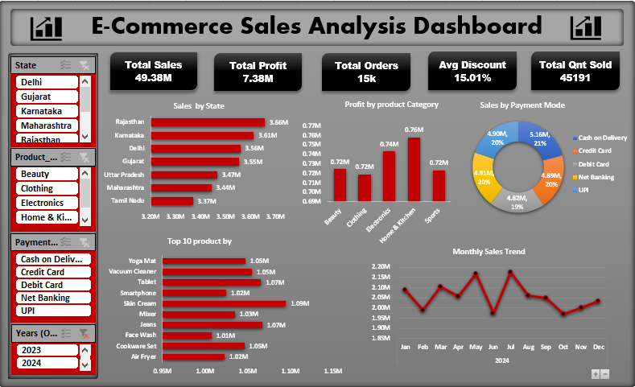

# 📊 Retail Sales & Profit Analysis Dashboard


---

# 📌 Project Overview

This project presents an interactive **Retail Sales & Profit Analysis Dashboard** developed in **Microsoft Excel**.

The project analyzes retail transaction data to evaluate **sales performance, profitability, product categories, states, payment methods, top-selling products, and monthly sales trends**. The dashboard converts raw business data into clear KPIs and actionable business insights.

---

# 🎯 Business Problem

Retail businesses need to understand which states, products, categories, payment methods, and time periods are contributing most to sales and profit.

This project aims to answer key business questions such as:

- Which state generates the highest sales?
- Which product category is most profitable?
- Which products generate the highest revenue?
- Which payment method performs best in the analysis?
- What is the monthly sales trend?

---

# 📁 Dataset Information

| Attribute | Details |
|---|---|
| Industry | Retail |
| File Format | Excel (.xlsx) |
| Analysis Tool | Microsoft Excel |
| Analysis Type | Sales & Profit Analysis |
| Total Records | 15,000 |
| Total Columns | 12 |

---

# 🛠 Tools & Techniques

- Microsoft Excel
- Data Cleaning
- Pivot Tables
- Pivot Charts
- KPI Cards
- Conditional Formatting
- Business Analysis
- Data Visualization
- Interactive Dashboard Design

---

# 📊 Dashboard KPIs

The analysis tracks important business metrics:

- 💰 **Total Sales:** ₹49.38M
- 📈 **Total Profit:** ₹7.38M
- 🛒 **Total Orders:** 15K
- 🏷️ **Average Discount:** 15.01%
- 📦 **Total Quantity Sold:** 45,191 units

---

# 📈 Business Analysis

The dashboard analyzes:

- Sales by State
- Profit by Product Category
- Top 10 Products by Sales
- Sales/Payment-Mode Analysis
- Monthly Sales Trend
- Overall Sales & Profit Performance

---

# 💡 Key Insights

- 🗺️ **Rajasthan** records the highest state sales at approximately **₹3.66M**.
- 🏠 **Home & Kitchen** is the most profitable product category with approximately **₹757.6K profit**.
- 🏆 **Skin Cream** is the top-selling product at approximately **₹1.09M revenue**.
- 💳 **Cash on Delivery** has the highest value in the payment-mode analysis at approximately **₹5.16M**.
- 📅 **July** records the highest monthly sales at approximately **₹2.17M**, while **October** records the lowest at approximately **₹1.97M**.
- 💰 Overall sales reached **₹49.38M** with **₹7.38M profit**.

---

# 💼 Business Recommendations

Based on the analysis:

- Focus on high-performing states such as Rajasthan.
- Promote profitable categories such as Home & Kitchen.
- Maintain inventory availability for high-revenue products such as Skin Cream.
- Monitor payment-mode performance to understand customer preferences.
- Track monthly sales trends to identify growth and seasonal opportunities.
- Monitor discounts and profitability to improve overall business performance.

---

# 📷 Dashboard Preview

> Add your dashboard screenshot below.



---

# 🚀 Skills Demonstrated

- Advanced Excel
- Data Cleaning
- Sales Analysis
- Profit Analysis
- KPI Development
- Pivot Table Analysis
- Dashboard Development
- Data Visualization
- Business Intelligence
- Business Reporting

---

# 📂 Repository Structure

```text
Retail-Sales-Profit-Analysis
│
├── Project-02.xlsx
├── Dashboard.png
└── README.md
```

---

# 🔮 Future Enhancements

- Add Power Query automation
- Build a Power BI version
- Connect the analysis to a SQL database
- Add sales and profit forecasting
- Develop advanced customer segmentation
- Automate dashboard refresh

---

# 👨‍💻 Author

**Manish Kashyap**

💻 GitHub: [Manish-kashyap](https://github.com/Manish-kashyap)

---

⭐ If you found this project useful, feel free to star the repository.
